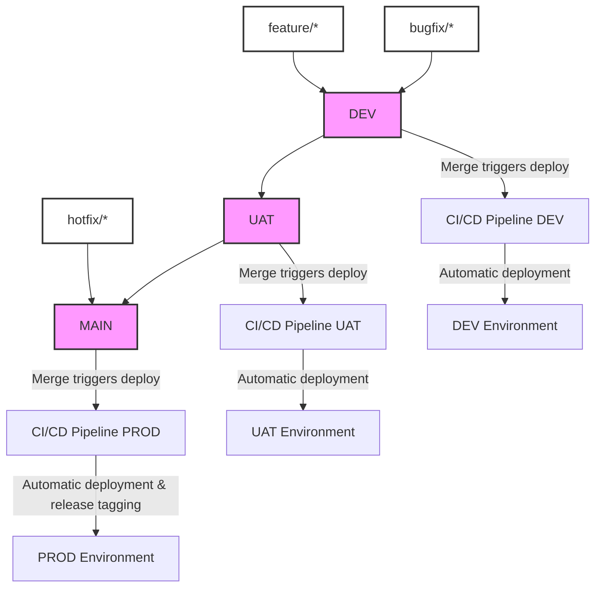

# NodejsMiddleware

[](https://github.com/careaccess/nodejs-middleware/actions/workflows/careaccess-admin-api.yml)
[](https://github.com/careaccess/nodejs-middleware/actions/workflows/ndia-middleware-api.yml)
[](https://github.com/careaccess/nodejs-middleware/actions/workflows/token-refresh-consumer.yml)
[](https://github.com/careaccess/nodejs-middleware/actions/workflows/token-refresh-producer.yml)

### Built With

This section contains the main structures/libraries used to start your project.

- <a alt="NodeJS" href="https://nodejs.org/" target="_blank" rel="noreferrer">Node.js</a>

- <a alt="NestJS" href="https://nestjs.com/" target="_blank" rel="noreferrer">Nest JS</a>

- <a alt="Nx" href="https://nx.dev" target="_blank" rel="noreferrer">Nx</a>

<p align="right">(<a href="#readme-top">back to top</a>)</p>

<!-- GETTING STARTED -->

## Getting Started

This is the step-on-step to setting up your project locally.
To get a local copy up and running follow these steps.

### Prerequisites

This is an example of how to list things you need to use the software and how to install them.

- Node.js: Download and install from the [Node.js website](https://nodejs.org/).

### Installation

To install the local environment execute theses steps:

1. Clone the repo
   ```sh
   git clone https://github.com/careaccess/nodejs-middleware.git
   ```
2. Install NPM packages in root folder in projet (nodejs-middleware)
   ```sh
   npm install
   ```
3. Create Aws Credentials file in C:\Users\\{YOUR_USER}\.aws\credentials
   ```txt
   [default]
   region = [region]
   aws_access_key_id=[aws_access_key_id]
   aws_secret_access_key = [aws_secret_access_key]
   ```
   <p align="right">(<a href="#readme-top">back to top</a>)</p>

## Start the app

### Run Apps

To start the development server, run the following commands or use 'debug session'

- For the producer: `npx nx serve token-refresh-producer`
- For the consumer: `npx nx serve token-refresh-consumer`
- For the Care Access Admin API: `npx nx serve careaccess-admin`
- For the NDIA Middleware API: `npx nx serve ndia-middleware`

### Run Tests

- For the producer: `npx nx test token-refresh-producer`
- For the consumer:`npx nx test token-refresh-consumer`
- For the Care Access Admin API: `npx nx test careaccess-admin`
- For the NDIA Middleware API: `npx nx test ndia-middleware`

<p align="right">(<a href="#readme-top">back to top</a>)</p>

## Environment Infos

### Dev environment

- <a href="https://ap-southeast-2.console.aws.amazon.com/sqs/v3/home?region=ap-southeast-2#/queues/https%3A%2F%2Fsqs.ap-southeast-2.amazonaws.com%2F756996390285%2Ftoken-refresh-queue-dev">Token Refresh Queue - AWS</a>
- <a href="https://ap-southeast-2.console.aws.amazon.com/cloudwatch/home?region=ap-southeast-2#logsV2:log-groups">Group Logs (CloudWatch) - AWS</a>

### UAT environment

- To be defined

### Production environment

- To be defined

<p align="right">(<a href="#readme-top">back to top</a>)</p>

## Components

### Dev environment

- <a href="https://api.dev.yourcareaccess.com.au/ndia-middleware/v1/docs">NDIA Middleware - API Docs</a>

- <a href="https://api.dev.yourcareaccess.com.au/careaccess-admin/v1/docs">Care Access Admin - API Docs</a>

### UAT environment

- <a href="https://api.uat.yourcareaccess.com.au/ndia-middleware/v1/docs">NDIA Middleware - API Docs</a>

- <a href="https://api.uat.yourcareaccess.com.au/careaccess-admin/v1/docs">Care Access Admin - API Docs</a>


## Branching Strategy
The branching strategy for the NodejsMiddleware repository is designed to support a robust development workflow that facilitates continuous integration and delivery across multiple environments: Development (DEV), User Acceptance Testing (UAT), and Production (PROD).


### Branching Model
The model incorporates three main branches:

- DEV for ongoing development and testing by developers.
- UAT for pre-release testing in a stable environment resembling production.
- MAIN for production releases.

### Workflow
1. Development:
   - Developers create feature branches (feature/*) and bugfix branches (bugfix/*) from DEV.
   - Upon completion, these branches are merged back into DEV through pull requests. Merging triggers an automated deployment to the development environment.

2. Staging for Release: 
   - Stable versions in DEV are merged into UAT for thorough testing and client approvals.
   - Merging into UAT triggers an automated deployment to the UAT environment.

3. Production Deployment: 
   - Once UAT testing is completed and the codebase is stable, changes from UAT are merged into MAIN.
   - Additionally, only PRs from bugfix/*, hotfix/*, and direct merges from UAT are allowed into MAIN. This ensures that only thoroughly tested and critical updates are deployed to production.
   - Merging into MAIN triggers an automated deployment to the production environment and initiates the CI pipeline to tag the release and create GitHub releases.
 

<p align="right">(<a href="#readme-top">back to top</a>)</p>

<p align="right">(<a href="#readme-top">back to top</a>)</p>
